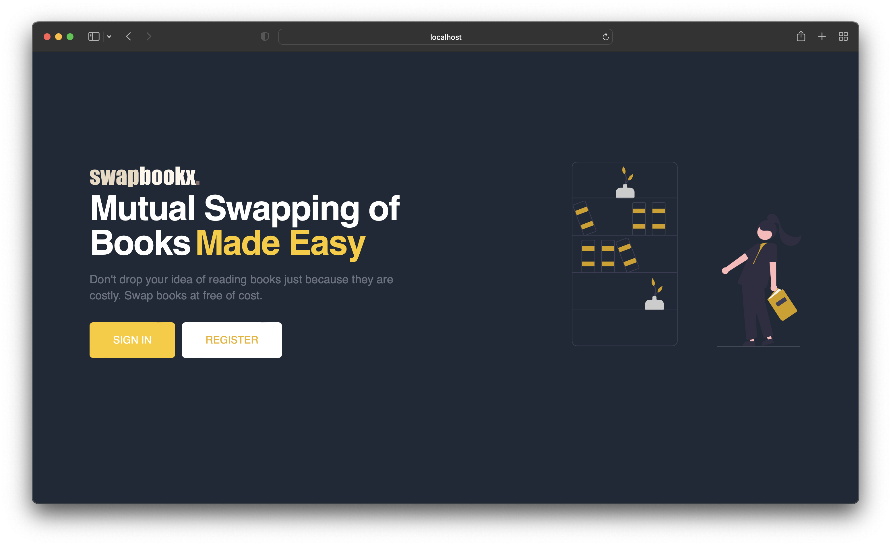
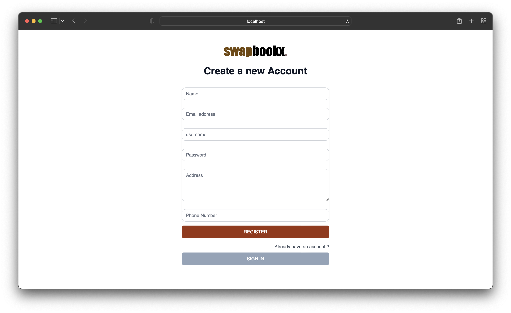
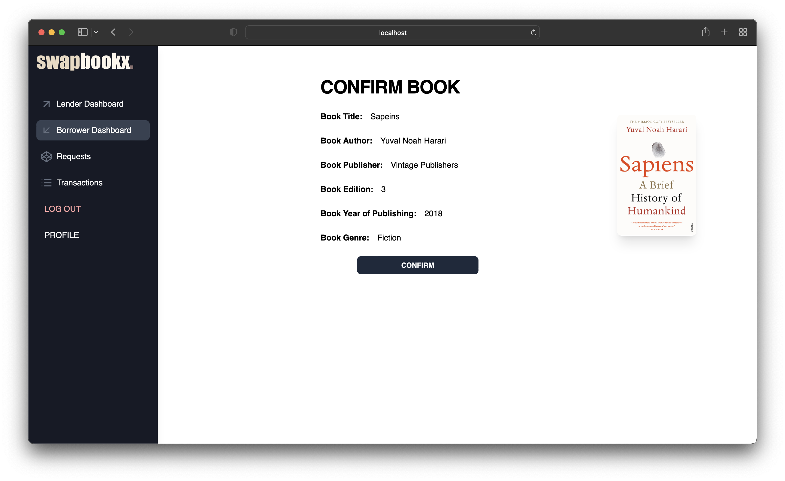
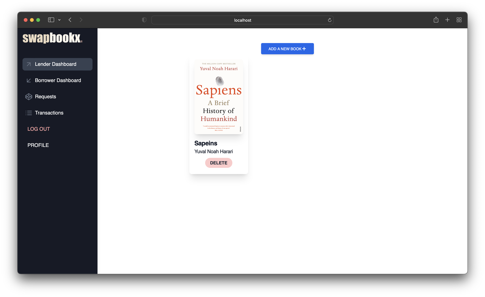
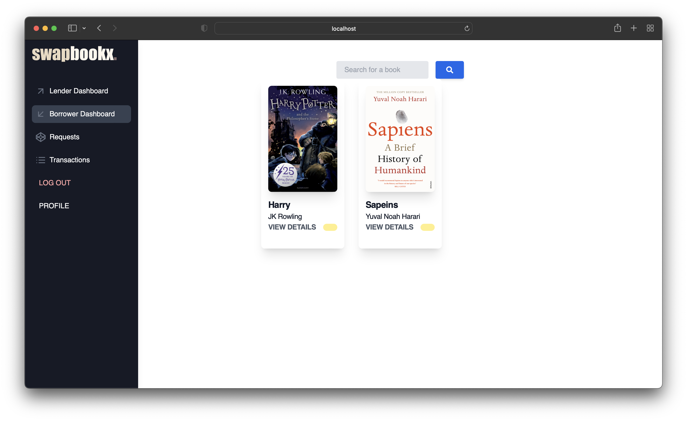
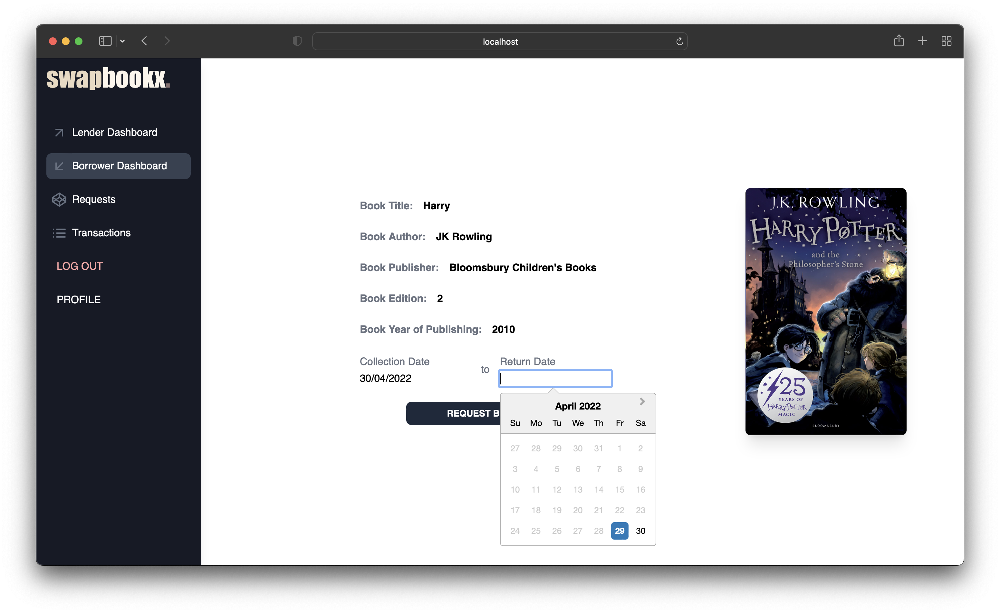

## swapbookx

Mutual Book Sharing made easy

|  |  |
| ----------------------- | ----------------------- |
|  |  |
|  |  |

#### How to use the app locally on your machine ?

<u> Requirements </u>

1. Java ( java 18 )
2. npm ( 8.5.0 )
3. react ( 18 )

**Step #1** : Clone this repository using

`git clone https://github.com/saiankit/swapbookx`

**Step #2** : Run the following command in the directory

`cd swapbookx`

To run the frontend

`cd frontend`
`npm install`
`npm run start`

To run the backend
`cd backend`
`Run the spring project in any IDE`
